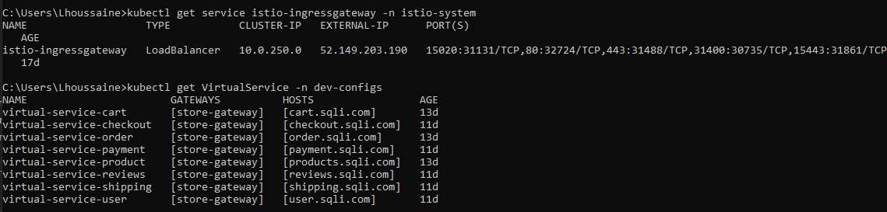
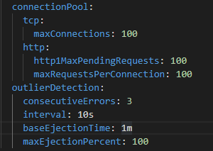
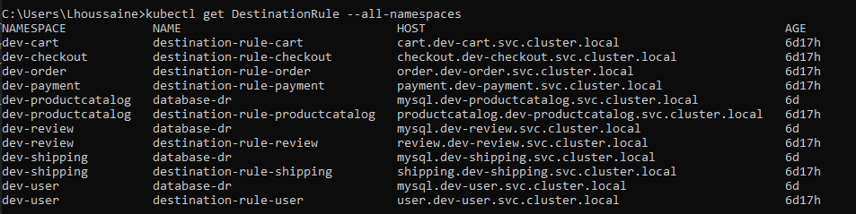
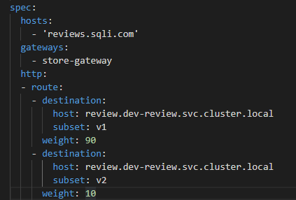
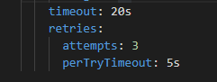
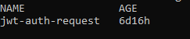
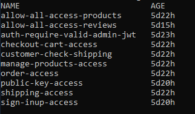
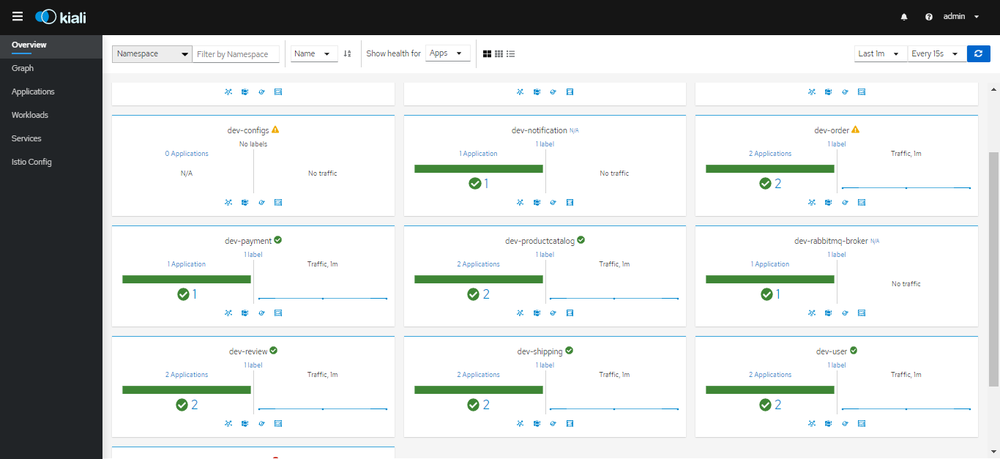
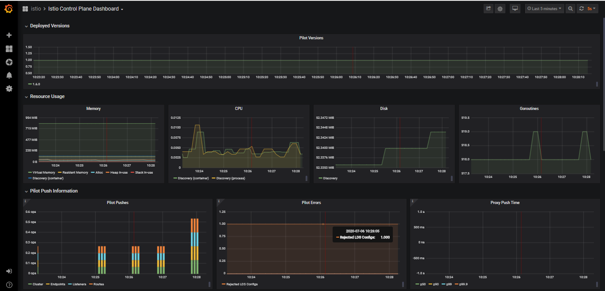

# Injection Of ISTIO as a service mesh solution :
1. **Features :**
+ ***Istio :*** Application works on Istio service mesh.
+ ***Istioctl :*** we need this Istio CLI to isntall Istio or to do update of Istio Configuratio.
2. **Install Istio :**
+ Refer to istio docs for different methods on how to install istio. Istio will be installed in a deferent namespace called istio-system.
In our application we will install Istio demo Profile 
> istioctl install --set profile=demo
+ Create a namespace for the shared Istio consigs of our application.
+ As we have already adding a namespace label to instruct Istio to automatically inject Envoy sidecar proxy in all namespace deplpyments. We can now apply all istio features.

3. **Trafic Management**
   1. ***Istio ingress gateway & virtual services***
       + An ingress Gateway describes a load balancer operating at the edge of the mesh that receives incoming HTTP/TCP connections. It configures exposed ports, protocols, etc. but, unlike Kubernetes Ingress Resources, It does not include any traffic routing configuration.

       + After creating the ingress gateway, we need to configure the virtual services; in other word, we need to think of ot as how to route traffic to a given destination (a given service). So, in our case, we associate a host to every service. 

       + Now, our application is accessible outside the cluster, using Postman, we can test every service accessibility.
       To create istio ingress gateway and virtualservices, run the command :

        > kubectl apply -f store-gateway.yaml
         
         the result : 
        
   2. ***Destination rules & Circuit Breaker***
   
       + ***Destination rules :***
         After that Virtual Services are configured and working properly, we need to configure Destination rules,they are used to configure what happens to traffic for that destination.

       + ***Circuit Breaker :***
         The circuit breaker  in Istio can limit TCP connections, requests per connection to the application and also can block the application for a period if there are more errors than the number set in the configuration.
          In our application:
       *  we have limited connections to the service to 100 connections, pending requests and max requests per second are also limited to 100.
       * We have also configured that in a 10-second interval, if there are three errors, the service will be blocked for one minute.

       

       To create distination  with a configured Circuit breaker run :
        > kubectl apply -f ./DestinationRules-with-circuit-breaker-and-enable-mtls.yaml
         
         the result : 
        
   3. **Canary Deployment**
         The «Review» service uses two versions, the first is simple version, and the second which contains user comments, Istio gives us the possibility to route the traffic based on a percentage, or the header.
       In our case, we distributed traffic based on a percentage, 90% of traffic will access version 1, and the rest to version 2. 
       To configure theis feature, we add the bellow config in the Review virtual service :
       
   4. **Retry & Timeout**
         For each service we have configured that after 5 seconds, if the server has not answered, we resend the request (3 possible attempts) and the waiting time «Timeout» will be 20 seconds.
       As we have done with Canary deployment, we all add Retry & Timeout configuration in the virtual service configuration : 
       
4. **Security :**
    1. ***authentication mTLS :***
      By default, Istio configures the destination workloads using the PERMISSIVE mode. When PERMISSIVE is enabled, a service can accept both plain text and mutual TLS traffic. In order not to allow mutual TLS traffic, the configuration must be changed to STRICT mode.
       - so, to make all services communication use MTLS, we execute the command :
    > kubectl apply -f peerAuth-mtls.yaml

       - to make all connections to databases use mTLS authentication, run the command :
    > kubectl apply -f databases-mtls.yaml

    2. ***Requests Authentications :***
        
        this will specify the values needed to validate a JSON Web Token (JWT). These values include, among others, the following:
       + The location of the token in the request
       + The issuer or the request
       + The public JSON Web Key Set (JWKS)
    To create that, we will execute the command :
    > kubectl apply -f ./auth-policy/jwt-request-auth..yaml

    Now, the application will accept requests with valid token and without it, and refuse that's with invalid one. So, to reject requests without tokens; we need to create an authorization policy for every access of a microservice. 
    To get all created request auths :
    > kubectl get requestauthentication  -n istio-system
    
    
     
    3. ***Authorization Policies :***
   
        In our case, we configure the authorization policies needed for every Microservice. so, to apply all the created authorization policies, run the command :
    > kubectl apply -f ./auth-policy/auth-per-path.yaml
    
      Now, the access to every microservice is limited by the authorizations based on user connected role, so we can view the resulting created auth policies by runing :
    > kubectl get authorizationpolicy  -n istio-system
    
    
5. **Obervability :**
   
   Kiali is a mesh service observation and configuration tool, it answers the questions:
    + What microservices are part of my Istio service mesh?
    +  How are they connected? How do they work?
    +  What version of the service does the traffic access?
    +  Does the breaker circuit work? 
    +  Is the mTLS enabled?
    Istio uses Kiali for viewing services.
    Kiali is preconfigured in our Istio Installation Profile (Demo).
    The figure below shows that Kiali can give us information about the health of our services, as in this figure, all services work:
    To access Kiali Dashboard, run the command : `istioclt dashboard kiali`
    the kiali dashbord :
    
6. **Monitoring :**
   To monitor an application installed and injected by Istio mesh, we use the preconfigured Istio addon Grafana, as we can see bellow, Grafan gives all the needed infos to monitor the application, as like :
       - Traffic in each service, and check the percentage of success of requests received for a service.
       - The memory resources used by each deployment, and also by all services in the Istio control layer.
       - The performance of the services injected by Istio, showing graphs for: the use of memory resources, and the number of requests executed at each moment for a given service.
    To access Kiali Dashboard, run the command : `istioclt dashboard grafana`
      the grafana dashbord :
    
   
   
