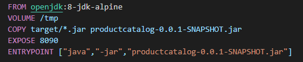
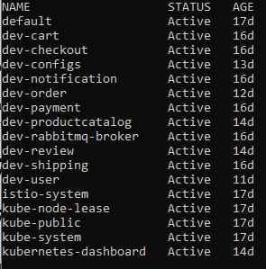
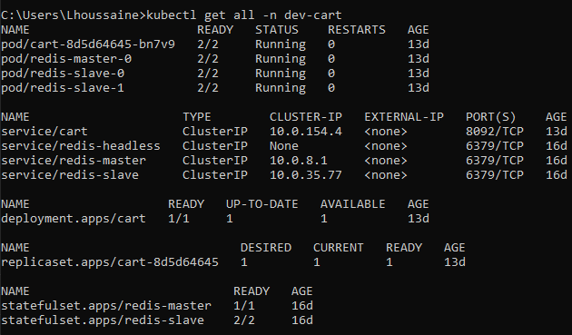
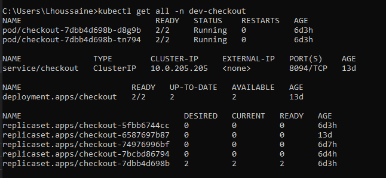
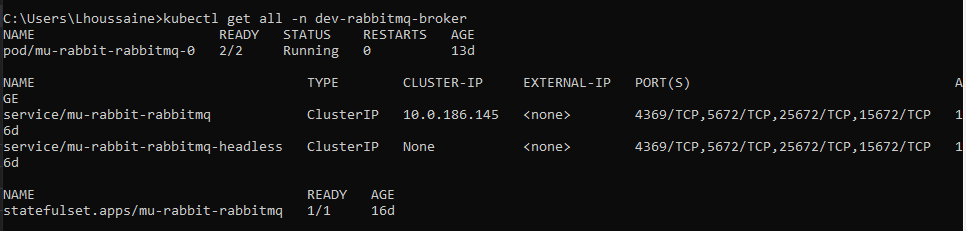
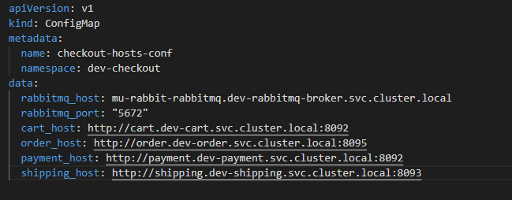

# Deployment of e-Commerce Application :
### Features and deployment environment :
Docker : is a set of platform as a service products that uses OS-level virtualization to deliver software in packages called containers. we used it to dockerize all microservices.
Kubernetes/AKS: The app is designed to run on an cluster Kubernetes of Azure Kubernetes Service (AKS).
Helm: helps you manage Kubernetes applications — Helm Charts help you define, install, and upgrade even the most complex Kubernetes application. Charts are easy to create, version, share, and publish — so start using Helm and stop the copy-and-paste.
### Dockerize microservices:
to dockerize microservices, we need firstly install docker locally, then we need to create a Dockerfile of each microservice, bellow an example of a Dockerfile content for productCatalog-service :


This file contains all necessary commands to be executed for creating docker image.

### create and prepare AKS Cluster :
- firstly crate account with AKS :
- login to  the account created :
> az login
- create a resource gtoup :
> az group create --name myResourceGroup --location eastus
- create a cluster in the resource created, with speciying nodes number :
> az aks create --resource-group myResourceGroup --name myAKSCluster --node-count 3 --enable-addons monitoring --generate-ssh-keys
- Now connect to the created cluster :
az aks install-cli (install kubectl cli command ) (we will do all work from local CLI)
az aks get-credentials --name myAKSCluster --resource-group myResourceGroup
- Now we can do all our deployments, by executing :
  > kubectl apply -f file-name.yaml
- Or deploy all folder files 
  > kubectl apply -f folder-name
### deploy all microservices :
#### Deployment Struture Configuration :
To well organize all deployments, we create a namespace speficied for every microservice with it's additional deployment Config( dabatabse for example).
Also we will create another namespace for shared configs.
`To avoid to restarting all deployments, as we will inject Istio by the end of the deployment of microservices, It is recommended to add a namespace label to instruct Istio to automatically inject Envoy sidecar proxy in all namespace deplpyments`
here an example of namespace yaml file :

<br> to get all namespaces, execute the command : ```kubectl get ns```
<br>


####  Deploy microservices :
The deployment of our microservices consists for deploying each service and its needs (either an instance of the database or the broker, secrets,configMaps…).
After the dockerizing of our Microservices using Docker, we need to deploy them in kubernetes, each application will be encapsulated in a kubernete “pod” so that it is a microservice execution unit.
The "checkout, notification, and payment" services do not use a database, so we need to install just the pod of each service.
The services «productcatalog, review v1 and v2, shipping and users» uses a Mysql database, so we need to install the pod for each microservice, and the pod of the Mysql database to have independence between microservices.
- The deployment of mongodb and rabbitMQ is not easy with yaml files,so to facilitate the deployment of it,we will use Helm package manager to install olds chart templates. 
- ```In the k8s-manifests every folder contains the necessary yaml files needed to configure a successfully microservice deployment. For every Microservice, we start with deploying secrets and configMaps, and deploy database or broker as microservice need, and finally deploy the microservice yaml file to create service Account , kubernetes service, and the deployment``` 
#### results :
bellow images present all deployments in dev-cart, dev-checkout, and rabbitmq namespaces :
+ *Dev-Cart* : 
  

+ *dev-checkout* :
  

+ *RabbitMq* :
  

### Communication inter Services in Kubernetes :
The communication between two microservices is based on kubernetes service, so to send a request to an other service, we need to know the IP address offered by kubernetes service or to use its name as a DNS.
The external-IP is not valid in our case,because we used the type «Clusterip» in the kubernetes service, in this case the service will be accessible just in the cluster with the DNS «productcatalog.dev-productcatalog.svc.cluster.local:8090». To make it accessible outside the cluster, we can use either: Nodeport, Loadbalancer or expose it via the Gateway API.
To communicate the application with the database or another service, we use the environment variables of the pods so that they can expose the variables such as the database or other service host, ports and container passwords that contain our applications.
we present bellow the configuration of services hosts used by the checkout-service to communicate with all necessary services :



