# Analysis and microservices development  
In this section we will cover all development needed, and some results of development of all microservices :
### Architecture:
Our demo application is composed of 10 microservices written in different languages that talk to each other.

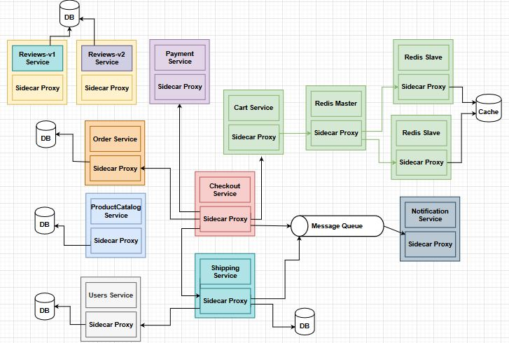  

  Service  | Details
  ------------- | -------------
  **ProductCatalog service**: | Developed using **Java** and **MySql** to persist our product.  
  **Review service v1** | Developed using **Java** and **MySql** to persist reviews.  
  **Review service v2** | Developed using **Java** and **MySql** to persist reviews with comments and share database with v1.  
  **Checkout service** | Developed using **Java**, this service is like a hub of our application, communicate with CartService, ShippingService, OrderService, UsersService, PaymentService and Notification service.  
  **Cart service** | Developed using **Java** and **Redis** for the  semi-persistence of our temp orders.  
  **Oder service** |  Developed using **NodeJs** and **Mongodb** to persist orders.  
  **Users service** | Developed using **Java**, **JWT** for security and **MySql** to persist our users and roles.  
  **Shipping service** | Developed using **Java**, **MySql** to persist shipments and send message to Notification Service using **RabbitMq**.  
  **Notification service** | Developed using **Java**, **RabbitMq** to receives messages and send email notification using **JavaMail**.  
  **Payment service** | Developed using **Java** and **Stripe** to process Order Payment.  
  
### fonctional analyse and specification on needs :

to realise our projet in a goog way, we firtly begin with a functional analysis. within  this , we define the main needs of our application, and the main users that can interact with it. we can resume the resulting needs with the following diagram:
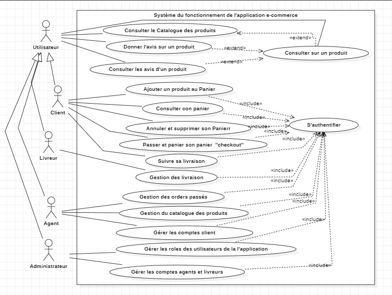  

### conception :
In this section, we will present the implementation of bounded context to define our microservices conception, and then we present the common software architectures used in developpment of the microservices :
#### build bounded contexts :
A commerce application gathers many contexts, as examples : users, products, payment,and shipping... . so in order to build the application in best way, we choose to follow the bounded context concept proposed by domaine-driven design Pattern. as a result of that we divide our appplication context into 9 microservices, any one of them implement a functionnality in our whole application.
In bellow we present two examples of our contexts bounded :

- Products Catalog bounded Context :
  
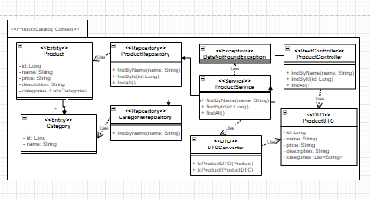

- Orders bounded Context : 

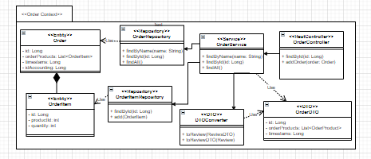  
#### sofwate architectures :
to develop our microservices, we focus on using two types of archicture in most of microservices :
1. Microservice architecture without broker needing :
   
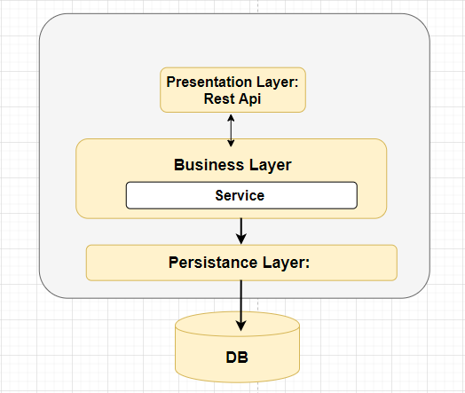
  in this first architecture, the microservice will be divided into three main layers and a database, we can this layers as like :
* **Presentation Layer :** it is presented by the contrroller layer of the microservice, it intercept and filtrate incoming requests. also it is the responsible of communicating with other services. 
* **Business Layer :** it handle all the business traitement. it could be divide into underlayers (as we have done in developpement of checkout microservice).
* **Persistence Layer :** it called by the Business layer, and it is responsibility is the communication with the database.
* **DB :** it could be any type of database: sql, nosql, or cached memory (redis in cart service).

2. Microservice architecture with broker needing :
     to communicate with other services, a service could use two types of communication :
* **synchronous communication :** This, a more direct approach, is represented by REST APIs. It essentially involves making HTTP calls, where in order for the information exchange to complete, the counterparty must process the request and get back to the requester with a corresponding response.
* **asynchronous communication:** it will be handled with a broker, in this type communication, the service send message to broker, the message will be added to message queuing to be saved , untill it the client consume, end it will be deleted from the queue.
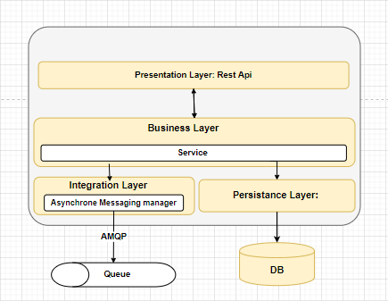

### Results :
we could explore results of the developpment of all microservices by consulting the swagger interface of each of them and executing requests : 
1. swagger interfaces :
We present bellow some examples of swagger results of microservices :
+ *users* :
  
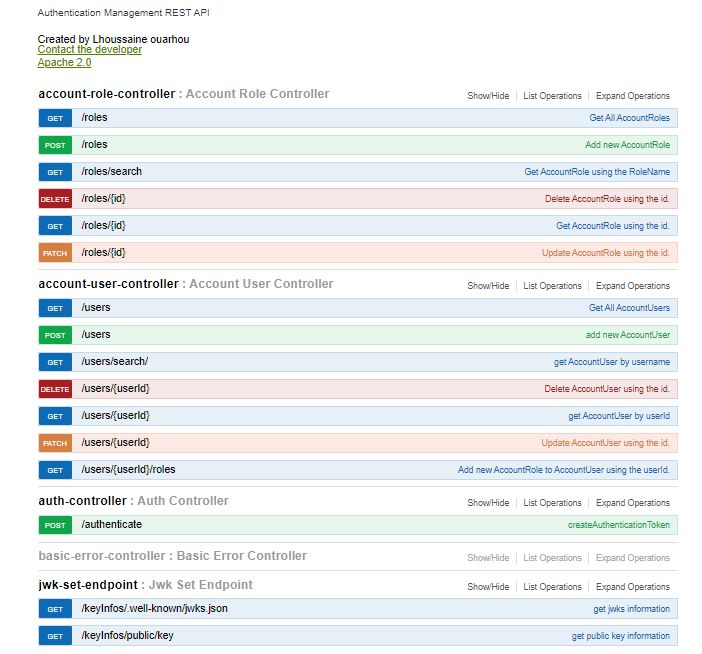
+ *products-catalog* :
  
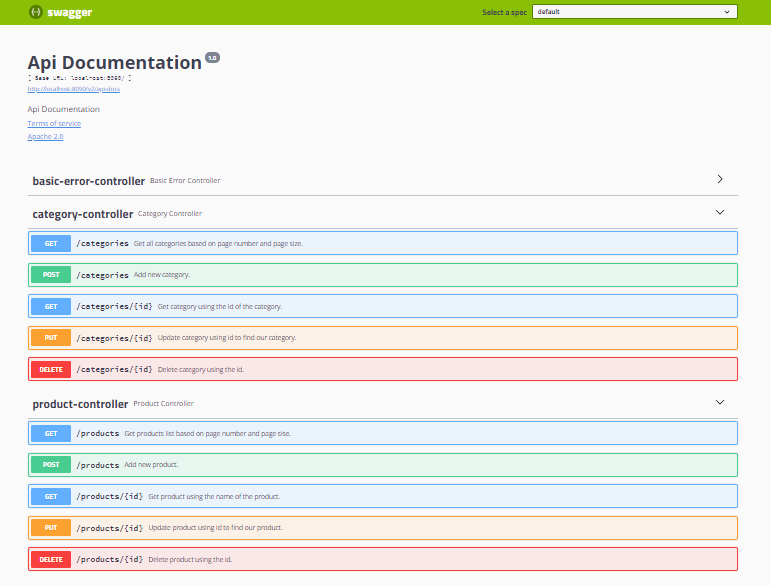
+ *order* :
  
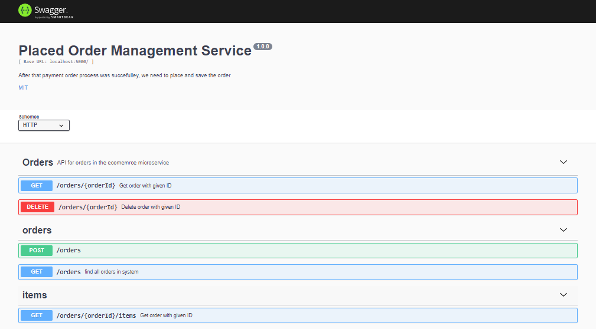
+ *checkout* :
  
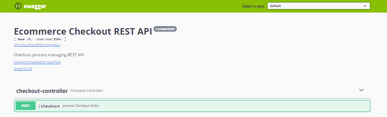
+ *shipping* :
  
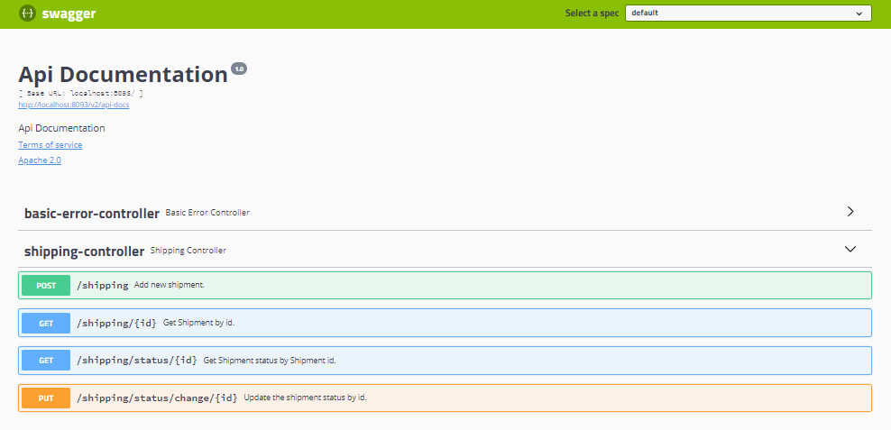

2. some results :
+ checkout execution result:
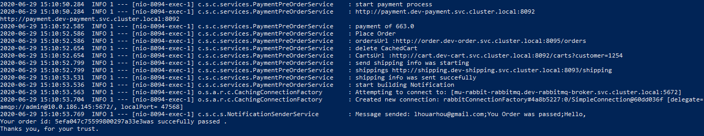

+ order purshasing notification :
  
  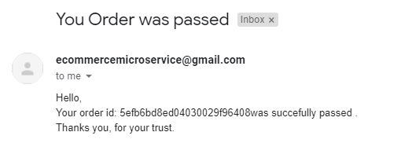
  
  
  

